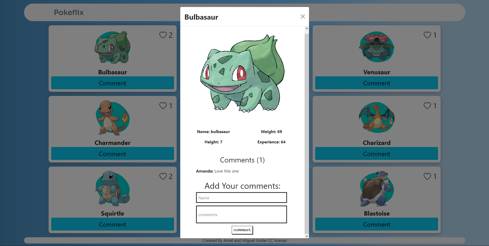
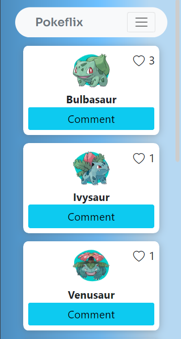
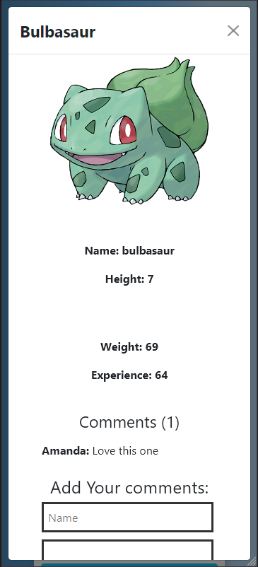
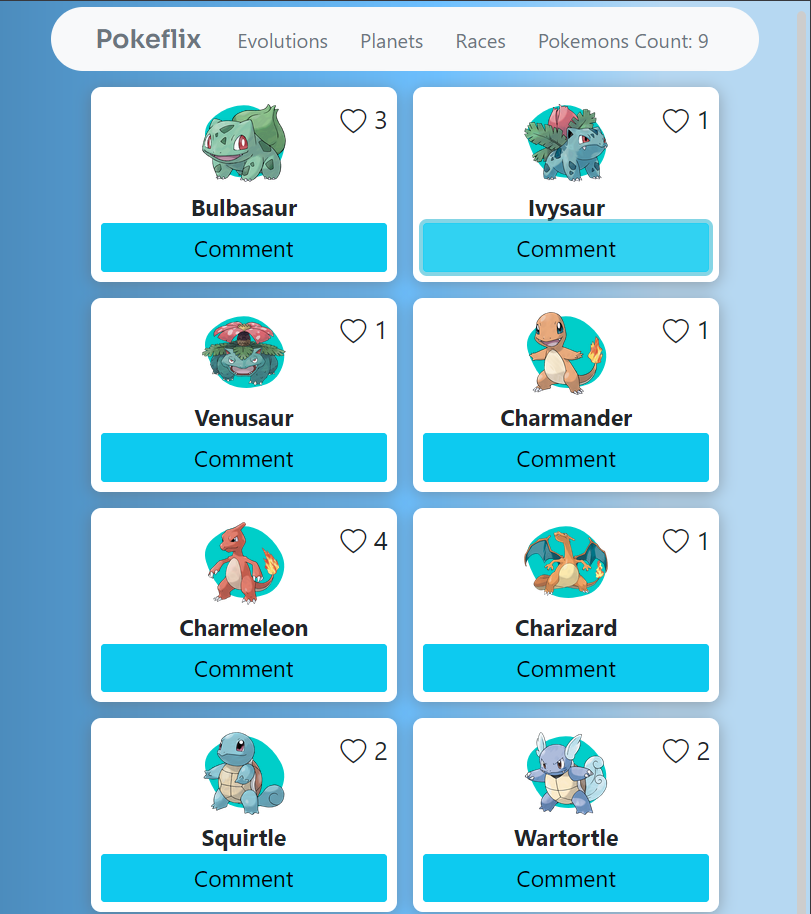

[![Contributors][contributors-shield]][contributors-url]
[![Forks][forks-shield]][forks-url]
[![Stargazers][stars-shield]][stars-url]
[![Issues][issues-shield]][issues-url]

<!-- PROJECT LOGO -->

 

  

  <h2 align="center">Pokeflix</h2>

  <h3 align="center">Javascript, Webpack, get from and save to API --> pokeflix<h3>
  

    <a href="#table-of-contents"><strong>Explore the docs »</strong></a>
     
     
    -
    <a href="https://github.com/Meltrust/pokeflix/issues">Report a Bug</a>
    -
    <a href="https://github.com/Meltrust/pokeflix/issues">Request a Feature</a>
    -
  

<!-- TABLE OF CONTENTS -->

## Table of Contents

- [About](#about)

  - [Desktop view](#desktop-view)
    - [Homepage](#homepage)
    - [Pokemon info and comments popup](#pokemon-info-and-comments-popup)
  - [Small devices view](#small-devices-view)
    - [Homepage phone](#homepage-phone)
    - [Pokemon info and comments popup phone](#pokemon-info-and-comments-popup-phone)
  - [Tablets view](#tablets-view)
    - [Homepage tablets](#homepage-tablets)
    - [Pokemon info and comments popup tablets](#pokemon-info-and-comments-popup-tablets)
  - [Demo](#demo)
  - [Made with](#made-with)
  - [Future updates and roadmap](#future-updates-and-roadmap)
  - [Getting started](#getting-started)
 
- [Authors](#authors)
- [Contributing](#contributing)
- [Show your support](#show-your-support)
- [Acknowledgments](#acknowledgments)
- [License](#license)

  
## About

A web desktop app that connects to an API to retrieve and save data from the **Pokemon** collection. Made with plain Javascript and served with Webpack. You can retrieve a list of Pokemons, submit comments and likes. Pagination is being added at a later updates.

 
  
## Desktop view  
  
### Homepage

  

  
 
  
### Pokemon info and comments popup
  
  
  
 

  
## Small devices view
  
### Homepage phone
  

     

  
### Pokemon info and comments popup phone
  

     

 

  
## Tablets view
  
### Homepage tablets
  

     

  
### Pokemon info and comments popup tablets
  

     

  

## Demo

https://meltrust.github.io/pokeflix/

## Made with

- Plain Javascript ✔️
- Webpack ✔️
- CSS3 ✔️
- HTML5 ✔️
- Api calls with Curl and Postman ✔️

## Future Updates and Roadmap

- More general styling.
- More Pokemons.
- Pagination.
- Auth.
- Responsive design

## Getting Started

To get a local copy up and running follow these simple example steps:

1. Under the repository name, click the Clone or download green button.

2. Copy the URL given by clicking the clipboard button

3. Open a terminal window in your local machine and change the current directory to the one you want the clone directory to be made.

4. Type  git clone and the paste the URL you previusly copied to the clipboard

5. Change the current directory to the newly created folder

6. Open the index.html file on your browser. You can add and remove books which persist on browser reloads.

7 .In your terminal, `npm install` to install the dependencies.

8. Now run `npm start` and the app should appear on your browser.

## Authors

👤 **Miguel Tapia**

- Github: [@meltrust](https://github.com/meltrust)
- Linkedin: [linkedin](https://www.linkedin.com/in/meltrust/)
- Or talk to me directly at: original.mtapia@outlook.com

👤 **Amal Hersi**

- GitHub: [Amal Hersi](https://github.com/Amalcxc)
- Twitter: [@Amalcx4](https://twitter.com/home?lang=en)
- LinkedIn: [Amal Hersi](https://www.linkedin.com/in/amal-hersi-a29583205/)

## Contributing

🤝 Contributions, issues and feature requests are welcome!

Feel free to check the [issues page](issues/).

## Show your support

Give a ⭐️ if you like this project!

## Acknowledgments

- Hat tip to anyone whose code was used
- Inspiration
- etc

## License

📝 This project is [MIT](lic.url) licensed.

<!-- MARKDOWN LINKS & IMAGES -->
<!-- https://www.markdownguide.org/basic-syntax/#reference-style-links -->

[contributors-shield]: https://img.shields.io/github/contributors/Meltrust/pokeflix.svg?style=flat-square
[contributors-url]: https://github.com/Meltrust/pokeflix/graphs/contributors
[forks-shield]: https://img.shields.io/github/forks/Meltrust/pokeflix
[forks-url]: https://github.com/Meltrust/pokeflix/network/members
[stars-shield]: https://img.shields.io/github/stars/Meltrust/pokeflix
[stars-url]: https://github.com/Meltrust/pokeflix/stargazers
[issues-shield]: https://img.shields.io/github/issues/Meltrust/pokeflix.svg?style=flat-square
[issues-url]: https://github.com/Meltrust/pokeflix/issues
